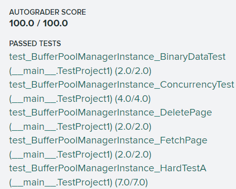

# Project 1 BUFFER POOL
## 前言
### Buffer Pool 主要功能
1. 从磁盘将一个页面调入内存，以供使用；
2. 将内存中的页面调出，并刷新磁盘；
3. LRU缓存淘汰机制，当内存不够用时，页面置换腾出空间（被线程引用的页面不许被淘汰）。

### Buffer Pool 基础组件
1. LRU Replacement policy 使用最近最久未使用算法淘汰页面；
2. Buffer Pool Manager Instance 核心组件，联系磁盘，内存和LRU；
3. Parallel Buffer Pool Manager 多个内存池，实现并发访问，提高效率。

---
## Part 1 LRU Replacement policy 具体实现
LRU最近最久未使用算法实现可以参考[LeetCode 146. LRU缓存]([146. LRU 缓存 - 力扣（LeetCode）](https://leetcode.cn/problems/lru-cache/))，主要实现方法也是采用哈希表和双向链表作为基础组件，此组件中可以暂不考虑并发问题。

### LRU 主要方法
*  ```Victim(frame_id_it *) ``` 当内存中无法承载新页面时调用此函数，从LRU中剔除出一块最近最久未使用的页面；
*  ```Pin(frame_id_t) ``` 线程需要使用某个页面，它一定不能被置换，也就是不能存在于LRU当中；
*  ```UnPin(frame_id_t) ``` 某个页面的线程引用计数为0，它可以被置换出去了，将其加入到LRU当中。

---
## Part 2 Buffer Pool Manager Instance
缓存池管理者主要功能是从磁盘中取出内存，将内存页刷盘，在内存不足时淘汰内存中的页面，需要考虑同步问题，即每个涉及页面操作的相关函数**都要上锁**。
本项目中的重点，其每个方法之间不存在联系，建议各个击破，同时在书写时思考某个页面在内存，磁盘和LRU中的状态（如：删除操作之后页面当然不能存在LRU当中）。

### Manager 主要参数
*  ```Page *pages_ ``` 用数组记录内存当中的所有页面；
*  ```Replacer *replacer_ ``` LRU结构，即Part 1实现类；
*  ```list<frame_id_t> free_list_``` 链表，记录内存中的空闲帧（即未加载内存页的帧）；
*  ```unordered_map<page_id_t, frame_id_t> page_table_ ``` 核心变量，记录页面号和内存帧号的映射关系，能够通过内存页号快速定位到帧；
*  ```mutex latch_ ``` 互斥锁，用于同步

### Manager 主要方法
*  ```FetchPgImg(page_id) ``` 某个线程将要使用该内存页面，如果该页面不存在于内存，从磁盘中取出，如果内存内容已满，通过LRU淘汰一页，再次加载，之后**Pin住该页面**，如果LRU中无可淘汰页（即内存中所有页都有线程使用），返回空；
*  ```NewPgImg(page_id) ``` 新建一个内存页面（它一定是脏的，需要写回），之后过程与抓取页面方法相同；
*  ```DeletePgImg(page_id) ``` 从内存中删除页面，如果有线程正在使用该页面，则不允许删除，删除之后将该页面对应帧返回给空闲链表（它也不能在LRU中存在）；
*  ```UnpinPgImg(page_id) ``` 某线程不再使用该也页面了，将其线程引用计数减一，若计数为0，则将其加入到LRU当中；
*  ```FlushPgImg(page_id) ``` 页面刷盘，写回磁盘当中。

---
## Part 3 PARALLEL BUFFER POOL MANAGER
本项目中最简单的一部分，Part 2 的扩展，可以发现，缓存管理者的每个方法执行时都需加锁，这对于涉及到高并发的访问来说是极其不利的，因此加入并行缓存池管理机制。
实现方法就是同时创建多个缓存池，通过水平取模的方法对页面进行分散，类似于MySQL的水平分表。
按照注释按部就班编写即可完成，不再赘述。

---
## 踩坑
1. 该项目中的LRU，其内部数据被引用过后，不需要将其移动的链表头部；
2. 无论何时，从内存中换出页面时，都要判断该页面是否脏了，“脏了”需要写回磁盘；
3. 刷盘的两个方法，无论其是否可读，都要进行写回磁盘操作（否则无法通过用例）。

---
## Score


