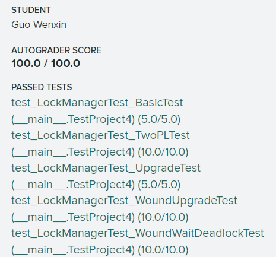

# Project 4 CONCURRENCY CONTROL
## 前言
### CONCURRENCY CONTROL 实现目标
* 锁管理器，实现不同隔离级别下的加共享锁，加独占锁，锁升级，释放锁，可重复读要满足严格二阶段锁协议；
* 死锁检测机制，严格二阶段锁协议由于加锁顺序不当可能会造成死锁；
* 将我们实现的锁管理器加入到执行器当中（Insert, Delete, Update）。

### 基本概念
#### 可串行化调度
* 如果一个执行调度能够和串行调度（即事务按顺序依次执行）等价，那么它就可以保证正确的**一致性**，该调度也被称为可串行化调度；
* 可串行化判断：冲突操作，即两个事务中冲突的操作不能在时间位置上互换，否则调度结果不一致，包括R-R R-W W-W。

#### 两阶段锁协议（2PL）
* 一种并发控制协议，规定了一个事务在运行过程中如何跟其它事务协调锁，达到可串行化；
* 具体实现是将**调度**执行关于锁的调度分为Growing和Shrinking两个阶段：
	* 增长阶段：在这个阶段事务只能获得锁，不能释放锁；
	* 缩减阶段：在这个阶段事务只能释放锁，不能再获取锁。
* 个人感觉也算是悲观协议的一种，在最开始的阶段将所有需要用到的锁全部获取，之后再依次释放锁。
* 实际应用当中，其实无法预知之后将要获取什么锁，因此具体实现是**当需要使用时获取锁（一直是Growing），然后在最后的提交/回滚阶段释放锁（Shrinking）**，此外，上述实现方法还可以**避免级联回滚，即脏读**的发生，这种方法也称为严格二阶段锁协议；
* 多说一句，基于上述的具体实现，为了提高并发量，针对有多个操作的事务，我们应该把不需要加锁的操作写在最前面，需要加锁的操作写在后面（尽量减少事务占有锁的时间），当然也要注意避免死锁。

#### 死锁预防
死锁预防有两种方法，根据时间戳划分事务的优先级，
* Wait-Die 高优先级事务获取低优先级事务已占有锁时，等待低优先级完成并释放锁；低优先级事务获取高优先级事务已占有锁时，低优先级直接回滚。
* Would-Wait 高优先级事务获取低优先级事务已占有锁时，低优先级直接回滚并释放锁；低优先级事务获取高优先级事务已占有锁时，等待高优先级完成并释放锁。

---
## Lock Manager
这里我们需要完成三种不同隔离级别下的锁管理，最好先整理一下隔离级别和对应的锁行为（如下），同时死锁预防的采用Would-Wait算法。
* 可串行化读：满足2PL协议，同时还要给索引上锁（也就是说被上锁的索引记录直至事务提交或回滚前不能被其它任何事务使用）；
* 可重复读：满足2PL协议即可；
* 提交读：共享锁不必满足2PL，用完释放即可；
* 未提交读：允许有脏读，不满足2PL，没有S锁的说法。

### Lock Manager 主要参数
* ```std::mutex latch_ ``` : 全局锁，给锁管理器的各个函数上锁；
* ```std::unordered_map<RID, LockRequestQueue> lock_table_ ``` : 存储所有需要给RID这条记录加锁的事务队列；

### Lock Manager 主要方法
* ```LockShared(Transaction *txn, const RID &rid) ``` : 事务txn给rid记录请求上共享锁，函数主要流程如下：
	* 如果事务是否已经终止（被回滚），直接返回false；
	* 如果事务的隔离级别是否为未提交读（RU），那么不能加共享锁（脏读），直接返回false；
	* 如果事务目前的状态是否为Shrinking，且隔离级别为可重复读（RR）时，此阶段只能释放锁，直接返回false；
	* 如果事务已经有锁了，直接返回true；
	* 真正的操作开始了，获取rid的事务队列中所有队列，依次遍历，如果队列事务具有的是共享锁，不冲突；如果队列事务（独占锁）比当前事务要新，队列事务执行无效，删除它；反之，当前事务需要等待（通过条件变量），等待后再次从头开始。
* ```LockExclusive(Transaction *txn, const RID &rid) ``` : 事务txn给rid记录请求上独占锁，函数主要流程如下：
	* 判断过程同共享锁的流程（除第2点）；
	* 获取rid的事务队列中所有队列，依次遍历，如果队列事务比当前事务要新，队列事务执行无效，删除它；反之，删除当前事务。
* ```LockUpdate(Transaction *txn, const RID &rid) ``` : 给事务txn的锁升级，这里需要多一步判断是否正在上锁，其余流程与加共享锁完全一致（这里需要多想一下，确实是一致的！）

* ```Unlock(Transaction *txn, const RID &rid) ``` : 释放锁，当它当前状态为Growing时，状态改为Shrinking，条件变量唤醒RID事务队列上的所有事务。

## Concurrent Query Execution
这里是给Project 3的执行器引入并发控制，使用我们的Lock Manager，注意更新等操作**不要忘记更新索引**。

### Seq_Scan_Executor
加共享锁，加锁方法基本一致，关于解锁方面，需要分类讨论：
* 可重复读：不能释放S锁，否则直接进入Shrinking；
* 提交读：要解锁的，这样才能读到不同的数据（不可重复读）；
* 未提交读：它就不会加S锁。

### Update_Executor / Delete_Executor
加独占锁，如果本身没有锁直接加，如果已经拥有共享锁，锁升级。

---
## Score
终于全部完成了！  

